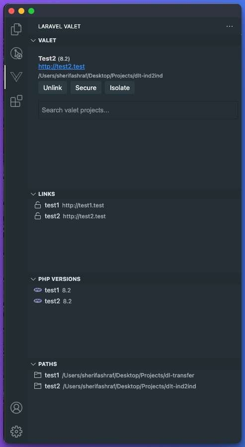
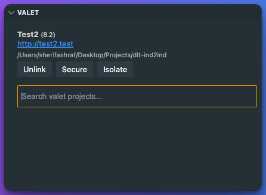
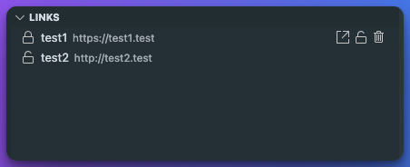
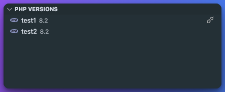
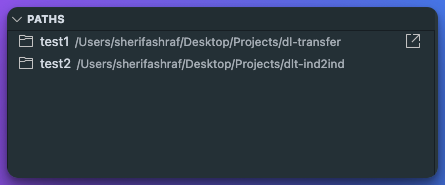
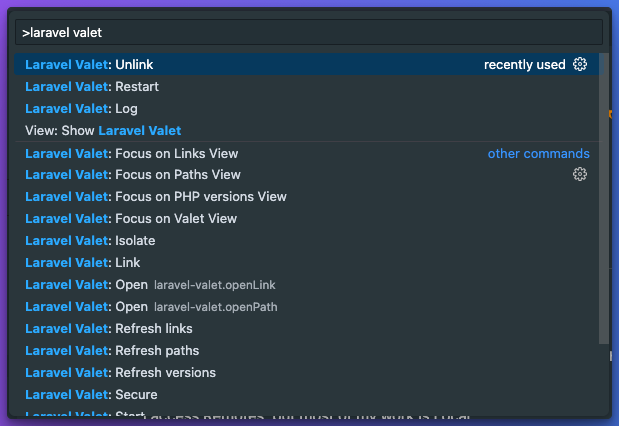

# Laravel Valet for VSCode

The Laravel Valet for VSCode is a powerful extension that helps you manage your Laravel Valet projects directly from your editor. It provides a seamless integration with Laravel Valet, a Laravel development environment for Mac minimalists, making it easier to handle your Laravel projects.

## Laravel valet
Providing a user-friendly interface for managing Laravel Valet projects. It display a list of current projects using valet, provide options for running Laravel Valet commands, and show the versions for each project

### Valet Area

Displays the current project using valet, providing a clear overview of your projects' locations, URL, and PHP version.

You have several options:

- **Link:** If a project is not linked, you can click the "Link" button to link it. This will switch the project to use Laravel Valet.

- **Unlink:** If a project is linked, you can click the "Unlink" button to unlink it. This will switch the project back to using the default web server.

- **Open in Browser:** Clicking the URL will open the project in your default web browser.

- **Secure:** If a project is not secured, you can click the "Secure" button to secure it. This will switch the project to use HTTPS.

- **Unsecure:** If a project is secured, you can click the "Unsecure" button to unsecure it. This will switch the project back to HTTP.

- **Isolate:** If a project is not isolated, you can click the "Isolate" button to isolate it. This will set the project to use a specific PHP version, separate from the default version set in Valet.

Also you have the search bar to filter your projects by name.

### Links Area

Displays all the links to your Laravel Valet projects, providing a quick and easy way to manage your projects.

Each link in this area represents a Laravel Valet project. The link shows whether the project is secured (HTTPS) or not (HTTP).

You have several options for each link:

- **Secure:** If a project is not secured, you can click the "Secure" button to secure it. This will switch the project to use HTTPS.

- **Unsecure:** If a project is secured, you can click the "Unsecure" button to unsecure it. This will switch the project back to HTTP.

- **Unlink:** The "Unlink" button removes the link from Laravel Valet, effectively stopping Valet from serving the project.

- **Open in Browser:** Clicking the "Open in Browser" button will open the project in your default web browser.

These options give you full control over your Laravel Valet projects, right from within VSCode.

### PHP Versions Area

Displays the PHP version used by each of your Laravel Valet projects, providing a clear overview of your projects' environments.

Each project in this area shows the PHP version it's currently using. This allows you to quickly identify any projects that might be running on an older or different PHP version than expected.

You have several options for each project:

- **Isolate:** If a project is not isolated, you can click the "Isolate" button to isolate it. This will set the project to use a specific PHP version, separate from the default version set in Valet.

- **Unisolate:** If a project is isolated, you can click the isolate button and press enter without entering the php version. This will revert the project back to using the default PHP version set in Valet.

These options give you full control over the PHP versions used by your Laravel Valet projects, right from within VSCode.

### Paths Area

Displays the paths to each of your Laravel Valet projects, providing a clear overview of your projects' locations.

Each project in this area shows the path to its root directory. This allows you to quickly identify any projects that might be in unexpected locations.

Giving you the option to open the project in your default file explorer.

### Avaliable commands

Displays the avaliable commands for Laravel Valet, providing a quick and easy way to run them.

## Features

Here are some of the outstanding features of Laravel Valet for VSCode:

1. **Project Management:** Easily list, open, and manage your Laravel Valet projects.

2. **Commands Integration:** Run Laravel Valet commands directly from VSCode.

3. **Status Checks:** Quickly check the status of your Laravel Valet installation.

## Installation

You can install Laravel Valet for VSCode directly from the Visual Studio Code Marketplace. Just search for "Laravel Valet" in the Extensions view (`Ctrl+P`), and click Install.

## Usage

After installation, you can access all features from the Laravel Valet panel in the sidebar. From there, you can manage your projects and run commands.

## License

Laravel Valet for VSCode is licensed under the [MIT License](LICENSE.md).My VSCode Extension is a powerful tool that helps you to [describe what your extension does].